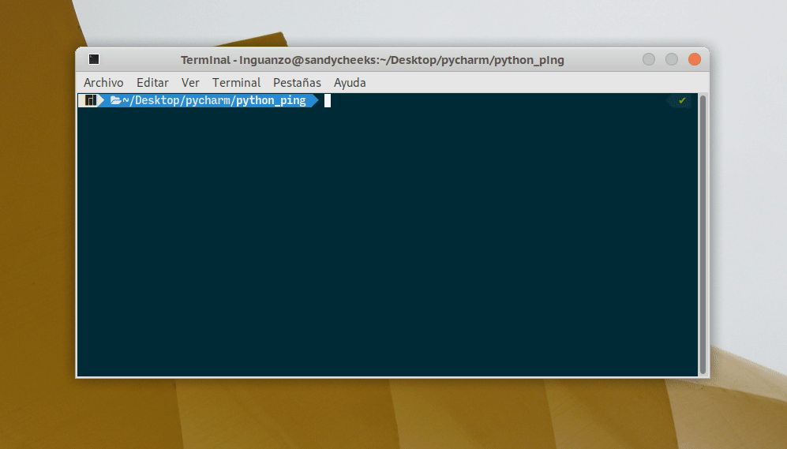

# python-ping
Una sencilla herramienta para verificar algunos elementos de una red usando python y fping.



Su uso es realmente muy sencillo. Se puede ejecutar directamente desde la terminal.

```
python python_ping.py
```

o si le da permiso de ejecución

```
chmod +x python_ping.py
./python_ping.py
```
## Configuración
El archivo **servidores.csv** es donde se almacena la información de los equipos que quiere revisar.

Básicamente es un nombre y puede ser una dirección IP o un dominio separados por comas.

Ejemplo:
```
Wikipedia,wikipedia.com
Google DNS 1,8.8.8.8
Google DNS 2,8.8.4.4
Quad9 DNS 1,9.9.9.9
Quad9 DNS 2,149.112.112.112
Yahoo,yahoo.com
Twitter,twitter.com
Facebook,facebook.com
Instagram,instagram.com
Error,8.8.8.4
Youtube,youtube.com
```

La variable **tiempo_entre_pruebas** le permite hacer una pausa. 

Esta en segundos, así que un valor de 600 le da un tiempo de 10 minutos antes de hacer otra prueba.

### Colorama
Uso el módulo [colorama](https://pypi.org/project/colorama/) para darle color a la salida del programa. 

Para instalarlo use la herramienta pip

```
sudo pip install colorama
```

### fping
Este programa utiliza [fping](https://fping.org/) en lugar del ping tradicional simplemente porque es más rápido.

Asi que no se le olvide instalarlo en su equipo antes de ejecutar este programa.

### Referencias.
* [Python Ping, un script que revisa las direcciones IP de tu red (2018)](https://linuxmanr4.com/2018/05/10/python-ping-script-ip/)
